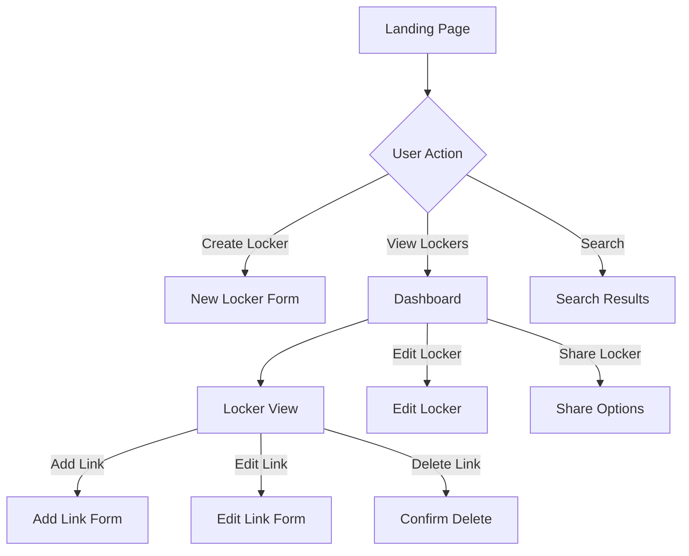

# LinkLocker Application Overview

## Purpose
LinkLocker is a web application designed to help users organize and manage their important links in a structured way, similar to a digital bookmark manager but with enhanced features for organization and sharing.

## Core Features

### 1. Link Management
- Save and organize links
- Add titles and descriptions
- Automatic link preview generation
- Tag-based organization
- Click tracking

### 2. Lockers (Collections)
- Group links into themed collections
- Public/Private visibility options
- Share lockers with other users
- Custom locker descriptions and covers

### 3. Dashboard
- Overview of all lockers
- Recent activity tracking
- Quick access to frequently used links
- Search functionality

## User Flow



## Component Structure

```
linklocker/
├── components/
│   ├── dashboard/
│   │   ├── DashboardView.tsx    # Main dashboard layout
│   │   ├── DashboardStats.tsx   # Statistics display
│   │   ├── LockerGrid.tsx       # Grid of locker cards
│   │   └── RecentActivity.tsx   # Recent actions list
│   ├── links/
│   │   ├── LinkCard.tsx         # Individual link display
│   │   └── AddLinkDialog.tsx    # New link form
│   └── shared/
│       ├── Navigation.tsx       # Main navigation
│       ├── SearchInput.tsx      # Search functionality
│       └── PageHeader.tsx       # Page headers
```

## Data Flow

1. **Link Management**
```typescript
interface Link {
  id: string;
  title: string;
  url: string;
  description: string;
  previewImage: string;
  tags: string[];
  createdAt: string;
  clickCount: number;
}
```

2. **Locker Management**
```typescript
interface Locker {
  id: string;
  title: string;
  description: string;
  linkCount: number;
  isPublic: boolean;
  imageUrl: string;
  links: Link[];
}
```

## Key Features Implementation

### 1. Link Organization
- Links are stored in collections called "Lockers"
- Each link can have multiple tags
- Links include metadata like creation date and click count

### 2. Search & Filter
- Full-text search across links and lockers
- Filter by tags
- Sort by various criteria (date, popularity)

### 3. User Interface
- Responsive design for all devices
- Dark/Light theme support
- Modern, clean UI with smooth transitions

## Future Enhancements

1. **Link Management**
   - Automatic tag suggestions
   - Bulk link import/export
   - Link validation and status checking

2. **Organization**
   - Nested lockers/folders
   - Custom taxonomies
   - Advanced sorting options

3. **Sharing & Collaboration**
   - Team workspaces
   - Public link sharing
   - Collaborative collections

4. **Integration**
   - Browser extension
   - Mobile app
   - API access